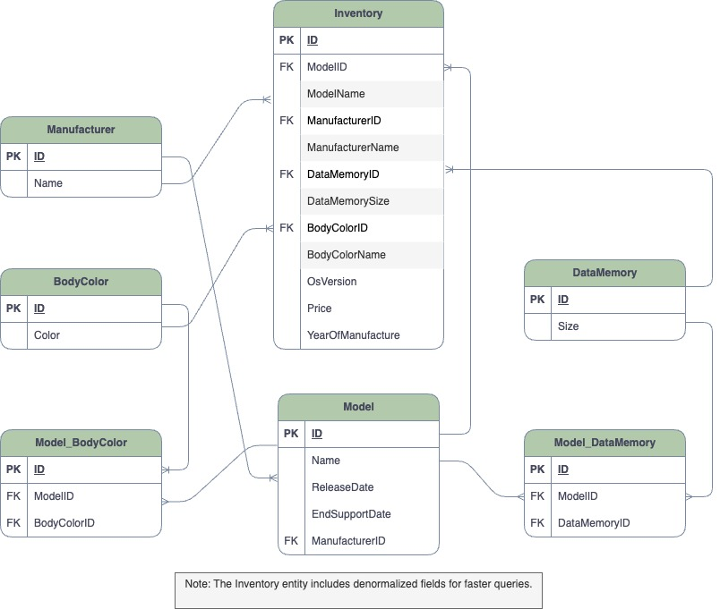
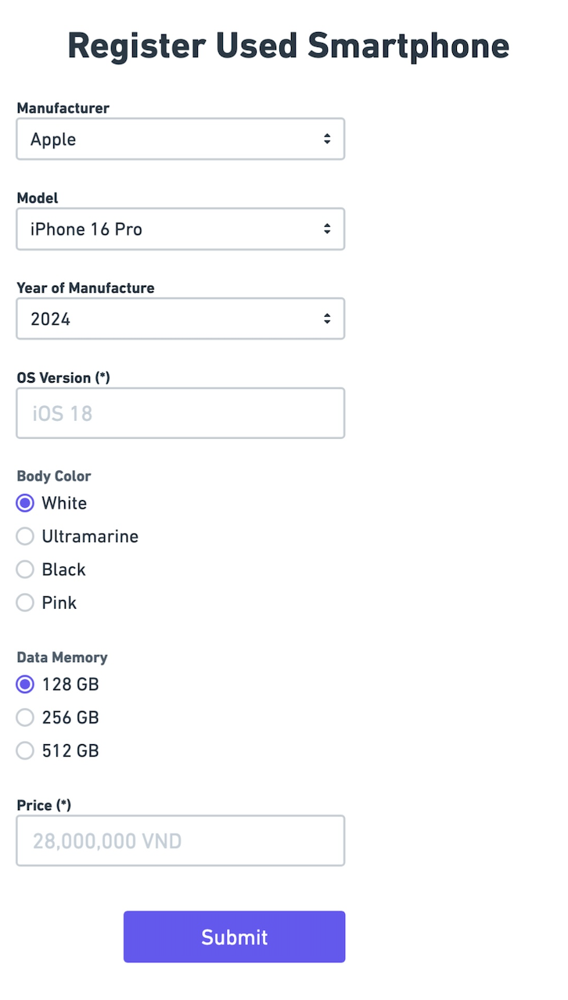

<p align="center">
  <a href="http://nestjs.com/" target="blank"></a>
</p>

## MVC

This project aims to build an inventory registration system for a SIM-free used-smartphone shop.

---

## Entity Relationship Diagram (ERD)

Below is the ERD and Wireframe for the smartphone inventory system:





### Explanation of the ERD:

1. **Manufacturer**:

   - Represents the manufacturer of the smartphone (e.g., Apple, Samsung).
   - Has a one-to-many relationship with `Model`.

2. **Model**:

   - Represents the smartphone model (e.g., iPhone 13, Galaxy S21).
   - Has a one-to-many relationship with `Inventory`.

3. **BodyColor**:

   - Represents the available colors for a smartphone model (e.g., Black, White).

4. **DataMemory**:

   - Represents the available memory configurations for a smartphone model (e.g., 128GB, 256GB).

5. **Inventory**:
   - Represents the inventory items, linking a specific model, body color, and memory configuration.

---

### Denormalization Note

This system applies **denormalization** to improve query performance and reduce the need for population when joining multiple collections. For example:

- Fields like `manufacturerName`, `bodyColorName`, and `dataMemorySize` are stored directly in the `Inventory` collection.
- This approach minimizes the overhead of querying related collections and ensures faster data retrieval for common use cases.

---

## Installation

```bash
# Clone the repository
$ git clone <repository-url>

# Navigate to the project directory
$ cd smartphone-inventory

# Install dependencies
$ npm install

```

## Running the app

```bash
$npm run dev:seed
```

## How to test the Inventory API

- Test with Postman or cURL
- Endpoint: POST /inventory
- Example:

```bash
curl --location 'http://localhost:3000/inventory/register' \
--header 'Content-Type: application/json' \
--data '{
    "manufacturerId": "67f560d2f8a5783ee84f3824",
    "modelId": "67f560d2f8a5783ee84f3830",
    "bodyColorId": "67f560d2f8a5783ee84f3828",
    "dataMemoryId": "67f560d2f8a5783ee84f382c",
    "osVersion": "iOS 15.0",
    "price": 999.99,
    "yearOfManufacture": 2021
}'

Response
{
    "_id": "67f56e09f77fdc4936f5c007",
    "modelId": "67f56df5f77fdc4936f5bfff",
    "modelName": "iPhone 13",
    "manufacturerId": "67f56df5f77fdc4936f5bff3",
    "manufacturerName": "Apple",
    "bodyColorId": "67f56df5f77fdc4936f5bff7",
    "bodyColorName": "Black",
    "dataMemoryId": "67f56df5f77fdc4936f5bffb",
    "dataMemorySize": "128GB",
    "osVersion": "iOS 15.0",
    "price": 999.99,
    "yearOfManufacture": 2021,
    "__v": 0
}
```

## ✅ Future Improvements

- **Improve Test Coverage**  
  Expand both unit and end-to-end (e2e) test coverage to ensure the reliability including edge cases and failure scenarios.

- **Implement Authentication and RBAC**  
  Add authentication and Role-Based Access Control (RBAC) to restrict inventory registration functionality. Only users with the `admin` or `manager` roles should be allowed to perform inventory-related actions.
